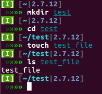

====================
Pwnとは？
====================

PwnはCTFというプログラミングの競技の中における一つの部門です。

CTF―Capture The Flag―では与えられたプログラムなどの脆弱性を突くことで隠された文字列（フラグ）を入手することで競い合う競技ですが、

Pwnはその中でもサーバーを攻撃してその制御を奪う部門と言えます。

制御を奪うと言っても、うまく想像できないとは思いますが、具体的には :command:`/bin/sh` のようなシェルを実行することを言います。

    fishシェルを使っている様子。

:numref:`terminal` は :command:`fish` というシェルを使っているところです。シェルを使うと様々なコマンドを実行することができ、
権限さえあればサーバーに置かれたファイルを自由に閲覧することも可能となります。

CTFでは厳密に言えば、どこかに書いてあるフラグを読み取ることが目的なので必ずしも :command:`/bin/sh` を実行しなければならないというわけではありませんが、

このドキュメントでは :samp:`Pwnの主目的 ＝ 制御を奪う ＝ シェルを実行する` こととして話をしていきます。

.. raw:: latex

    \clearpage

.. include:: pwn_route.rst